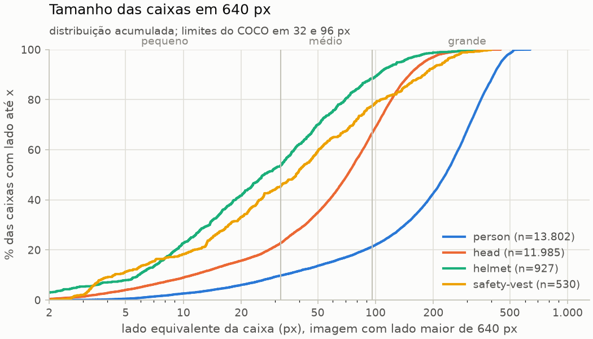
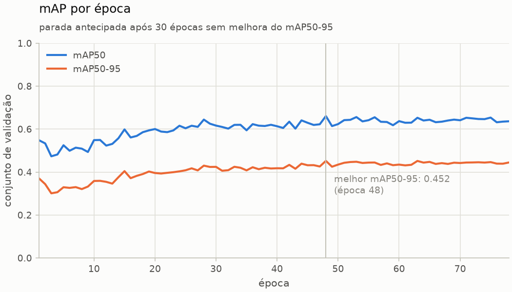
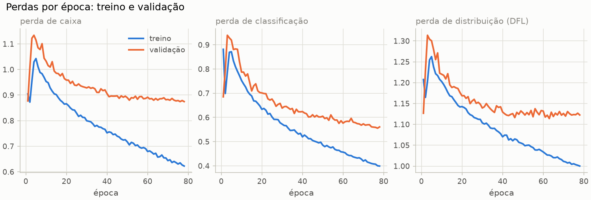
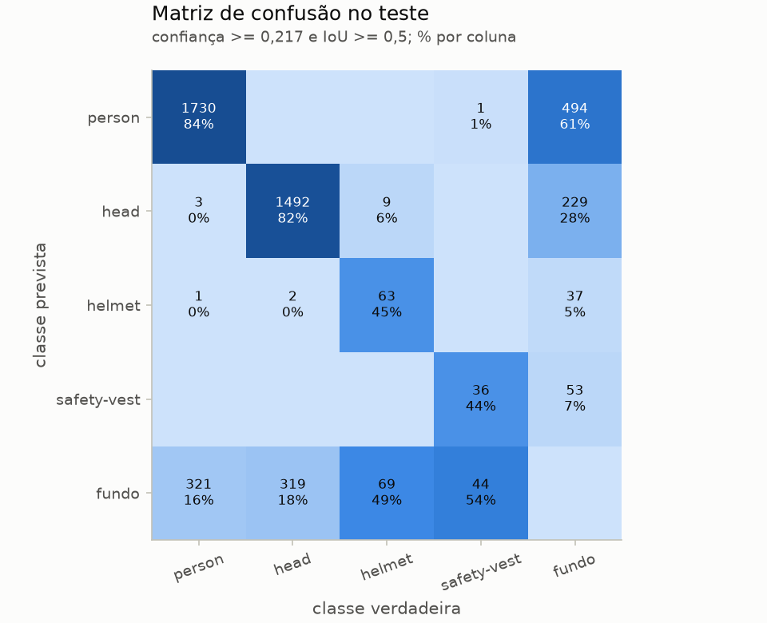
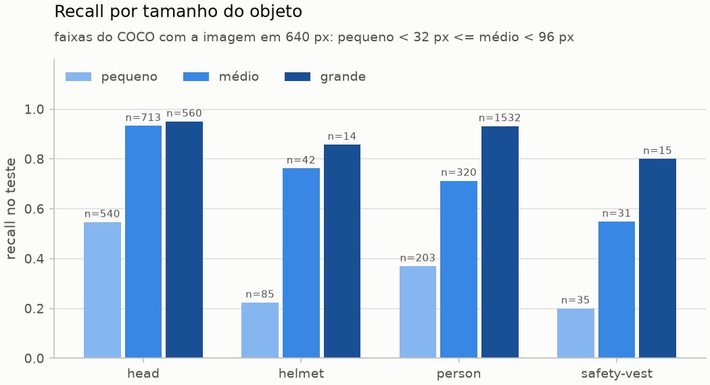
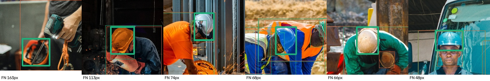
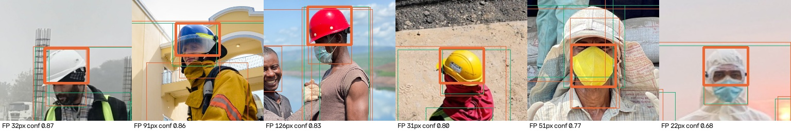
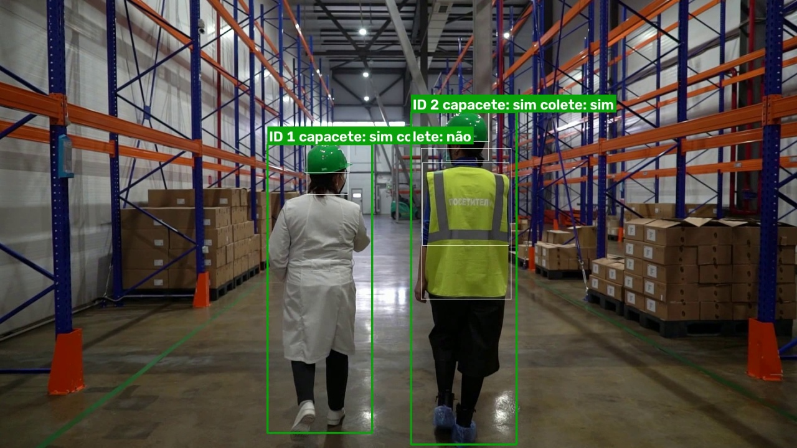
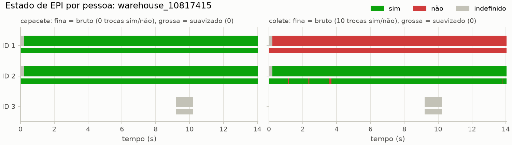

# Detecção de EPIs com rastreamento

Projeto de visão computacional com o objetivo de detectar capacete e colete em trabalhadores, atribuir um ID a cada pessoa com ByteTrack e registrar quem ficou sem capacete e por quanto tempo.

Em desenvolvimento. Resultados, instruções de reprodução e limitações serão documentados conforme as etapas forem concluídas.

## Ambiente

Python 3.11, PyTorch 2.14.1 com CUDA 12.6 e Ultralytics 8.4.171, rodando em uma RTX 3060 Ti (8 GB) no Windows.

```powershell
python -m venv .venv
.\.venv\Scripts\Activate.ps1
pip install -r requirements.txt
pip install -e .
python scripts\check_gpu.py
```

## Dados

Uso o [SH17](https://github.com/ahmadmughees/SH17dataset) (Ahmad e Rahimi, 2024, [doi:10.1016/j.jnlssr.2024.09.002](https://doi.org/10.1016/j.jnlssr.2024.09.002)), um dataset de EPIs voltado à indústria, com 8.099 imagens do Pexels e 17 classes, sob licença CC BY-NC-SA 4.0. As imagens não são redistribuídas neste repositório. Das 17 classes, uso quatro: `person`, `head`, `helmet` e `safety-vest`.

Para baixar e preparar (download de 13 GB; cerca de 29 GB em disco ao final):

```powershell
mkdir data\raw
curl.exe -L -C - -o data\raw\sh17.zip https://www.kaggle.com/api/v1/datasets/download/mugheesahmad/sh17-dataset-for-ppe-detection
python -m zipfile -e data\raw\sh17.zip data\raw\sh17
python scripts\prepare_sh17.py
python scripts\split_dataset.py
python scripts\find_near_duplicates.py
python scripts\analyze_dataset.py
```

Decisões sobre os dados:

- O download do Kaggle não inclui o arquivo com os nomes das classes. Converto a partir dos nomes nas anotações VOC, sem depender da ordem dos índices. Conferi que os índices YOLO batem com esses nomes em todas as caixas e com a ordem do `sh17.yaml` do repositório oficial.
- Na divisão oficial, 92% das imagens de validação são de fotógrafos que também aparecem no treino, e fotos de uma mesma sessão podem ser quase idênticas. Refiz a divisão em 70/15/15 agrupando por fotógrafo e equilibrando, entre os conjuntos, tanto o número de caixas quanto o número de imagens que contêm cada classe. Equilibrar só as caixas deixava a validação com 5 imagens de colete, uma delas com 50 coletes; agora são 32 na validação e 32 no teste. A divisão usada está em [configs/sh17_epi_split.csv](configs/sh17_epi_split.csv).
- Procurei quase-duplicatas com dHash. Nos pares que inspecionei, as duplicatas reais tinham distância de até 6 bits (de 64). Na minha divisão, os 2 pares nessa faixa que atravessam conjuntos são imagens diferentes; na oficial, 6 atravessam e todos são da mesma sessão de fotos. O dHash não detecta recortes nem imagens espelhadas.
- Reduzi as imagens para no máximo 1280 px no lado maior. As originais têm mediana de 23 megapixels, e decodificá-las a cada época deixaria o treino limitado pela CPU.

O que a análise mostrou ([reports/dataset](reports/dataset)):

- `person` tem 26 vezes mais caixas que `safety-vest`. Colete aparece em 213 imagens e capacete em 466.
- Com a imagem em 640 px, 53,6% dos capacetes têm menos de 32 px de lado, a faixa de objetos pequenos do COCO. Em 1280 px, são 35,9%.
- 88% dos capacetes e coletes têm pelo menos 90% da área dentro de uma caixa de pessoa, e 79% dos capacetes têm pelo menos metade da área dentro de uma caixa de cabeça. Ou seja, o SH17 costuma anotar a cabeça mesmo quando há capacete.
- Só 6,1% das cabeças têm um capacete sobreposto: boa parte das imagens não é de obra ou fábrica.
- No treino, 10 fotógrafos respondem por 53,5% das imagens.



## Treino

Fiz fine-tuning do YOLOv8s pré-treinado no COCO, com a configuração em [configs/train_yolov8s_640.yaml](configs/train_yolov8s_640.yaml):

```powershell
python scripts\download_weights.py
python scripts\train.py configs\train_yolov8s_640.yaml
python scripts\summarize_training.py
```

Escolhi o YOLOv8s em vez do YOLOv8n medindo os dois na minha GPU com [scripts/profile_models.py](scripts/profile_models.py) ([saída](reports/train/profile_models_rtx3060ti.txt)). O s tem 11,2 M de parâmetros e 28,6 GFLOPs, contra 3,2 M e 8,7 GFLOPs do n. Com batch 1, que é como o vídeo é processado, os dois levaram cerca de 8 ms por quadro, e esse tempo foi praticamente igual ao que a CPU gasta só para lançar os kernels na GPU. Com batch 32, em que a GPU fica de fato ocupada, o s custou 2,24 ms por imagem e o n, 1,14 ms. Ou seja, quadro a quadro, a capacidade extra do s sai quase de graça.

Decisões da configuração:

- Imagem de 640 px, batch 16 com acumulação de gradiente até um batch efetivo de 64.
- SGD com taxa de aprendizado inicial de 0,01, fixado em vez do modo automático, que escolhe o otimizador pelo número de iterações e mudaria conforme o batch.
- Até 100 épocas, com parada antecipada após 30 épocas sem melhora do mAP50-95 na validação.
- Semente 0 e modo determinístico: repetir o treino na mesma máquina dá o mesmo resultado.

Treinei na RTX 3060 Ti. O treino parou na época 78; a melhor época foi a 48, e levou 1,3 hora contando a validação de cada época. Na validação, o modelo da época 48 chegou a **mAP50 de 0,661 e mAP50-95 de 0,452**. O desempenho no conjunto de teste, que não foi usado em nenhuma decisão, fica para a etapa de avaliação. O registro completo, com configuração, versões e commit usados, está em [reports/train/yolov8s_640](reports/train/yolov8s_640).



Por volta da época 45, as perdas de validação de caixa e de distribuição param de cair enquanto as de treino continuam caindo: o modelo começa a se ajustar ao treino sem ganho em imagens novas, e a parada antecipada agiu nesse platô.



## Avaliação

```powershell
python scripts\evaluate.py
python scripts\analyze_errors.py
```

Avaliei o modelo uma única vez no conjunto de teste, que não participou de nenhuma decisão. O limiar de confiança, 0,217, foi escolhido na validação, como o que maximiza o F1 médio das quatro classes. Resultados em [reports/eval/yolov8s_640](reports/eval/yolov8s_640):

| Classe | mAP50 | mAP50-95 | Precisão | Recall | F1 |
|---|---|---|---|---|---|
| person | 0,864 | 0,652 | 0,778 | 0,842 | 0,808 |
| head | 0,846 | 0,607 | 0,861 | 0,823 | 0,842 |
| helmet | 0,483 | 0,300 | 0,612 | 0,447 | 0,516 |
| safety-vest | 0,422 | 0,247 | 0,404 | 0,444 | 0,424 |
| **todas** | **0,653** | **0,451** | 0,664 (média) | 0,639 (média) | |

- O mAP50-95 no teste (0,451) ficou igual ao da validação (0,452): escolher o modelo pela validação não a superajustou.
- O mAP vem do Ultralytics. Precisão, recall e F1 eu calculei no pipeline de inferência, com uma classe por caixa, casando detecções e anotações por IoU >= 0,5 em ordem de confiança. Comparando os dois cálculos no conjunto de validação, no mesmo limiar, os meus números de capacete e colete ficaram abaixo dos do Ultralytics: a validação dele deixa uma mesma caixa ter várias classes (`multi_label=True`), o que explicou metade da diferença no recall de capacete. O restante eu não isolei.
- A matriz de confusão do Ultralytics usa confiança mínima de 0,001, que serve para o mAP mas não representa o uso real. Por isso calculei a minha no limiar de operação.



O que os erros mostram:

- **Tamanho é o fator principal.** O recall de capacete é de 22% para objetos pequenos (menos de 32 px), 76% para médios e 86% para grandes, e 85 dos 141 capacetes do teste são pequenos. Todas as classes seguem o mesmo padrão, como a análise do dataset indicava.
- **O modelo quase não troca uma classe por outra; ele deixa de detectar.** Dos 78 capacetes perdidos, 69 não foram detectados como nada e 9 viraram cabeça.
- **Em 44 dos 78 capacetes perdidos (56%), o modelo detectou a cabeça no mesmo lugar**, mas não o capacete.
- **Revisei um por um os 40 falsos positivos de capacete** ([revisão](reports/eval/yolov8s_640/helmet_fp_review.csv)): 22 são outros itens na cabeça (bonés, capuzes de macacão de proteção, máscaras contra poeira), 7 são erros de enquadramento sobre objetos anotados, 5 são fundo, 4 são capacetes reais sem anotação e 2 são ambíguos. Se esses 4 estivessem anotados, a precisão de capacete subiria de 0,612 para cerca de 0,650. É uma estimativa por inspeção visual, não uma medida.



Capacetes perdidos, dos maiores para os menores (verde: anotação; laranja: detecção):



Falsos positivos de capacete de maior confiança:



Os exemplos são recortes de imagens do SH17 (Pexels), sob CC BY-NC-SA 4.0.

## Rastreamento

```powershell
mkdir data\videos
curl.exe -L -o data\videos\warehouse_10817415.mp4 https://www.pexels.com/download/video/10817415/
curl.exe -L -o data\videos\site_30331740.mp4 https://www.pexels.com/download/video/30331740/
python scripts\evaluate.py --split val --out reports\eval\yolov8s_640_val
python scripts\calibrate_head_size.py
python scripts\track_video.py data\videos\warehouse_10817415.mp4
python scripts\track_video.py data\videos\site_30331740.mp4
python scripts\analyze_tracking.py reports\track\warehouse_10817415 reports\track\site_30331740
python scripts\snapshot.py runs\track\warehouse_10817415.mp4 reports\track\warehouse_10817415\snapshot.jpg --time-s 9
```

Em cada quadro, o detector encontra pessoas, cabeças, capacetes e coletes; o ByteTrack dá um ID a cada pessoa; e cada cabeça, capacete e colete é atribuído à pessoa que o contém, com as regras em [src/epi/track/ppe.py](src/epi/track/ppe.py). A configuração está em [configs/track.yaml](configs/track.yaml).

Decisões:

- **Pessoas entram no ByteTrack a partir de confiança 0,1.** A segunda etapa de associação do ByteTrack usa detecções fracas para manter o ID de quem está parcialmente encoberto. Cabeça, capacete e colete usam o limiar de 0,217 escolhido na validação.
- **Usei os limiares do ByteTrack original** ([configs/bytetrack.yaml](configs/bytetrack.yaml)): um ID novo só nasce com confiança acima de 0,6. Com os 0,25 padrão do Ultralytics, detecções fracas de prateleiras viravam pessoas: o vídeo do armazém tinha 5 IDs para 2 pessoas.
- **O sistema só afirma que falta um EPI quando consegue enxergá-lo.** Se a cabeça da pessoa tem menos de 32 px na entrada do modelo, ou não foi detectada, o estado é "indefinido", e não "não". Calibrei esse limite na validação com [scripts/calibrate_head_size.py](scripts/calibrate_head_size.py): abaixo de 32 px, o recall de capacete fica em 32% ou menos; acima, entre 70% e 92% ([calibração](reports/track/head_size_calibration.csv)). Com faixas de 8 px, o limite saía 24 px, mas decidido por uma faixa com só 6 capacetes; usei faixas de 16 px, que dão a escolha mais conservadora.
- **O estado é suavizado no tempo:** só muda quando 70% das observações decisivas do último meio segundo concordam.

Testei em dois vídeos do Pexels, [um armazém](https://www.pexels.com/video/workers-with-safety-helmets-in-warehouse-10817415/) (1080p, 14 s, de Низам DRedd) e [uma obra](https://www.pexels.com/video/construction-workers-collaborating-on-site-30331740/) (4K, 7,8 s, de aksinfo7 universe). Vídeos públicos não têm anotação de rastreamento, então não calculei métricas como MOTA ou IDF1: conferi cada ID nos quadros anotados.



A cor da caixa de cada pessoa indica o estado do capacete: verde para "sim", vermelho para "não" e cinza para "indefinido". As caixas finas brancas são os capacetes e coletes atribuídos a ela.

**Armazém:** as duas pessoas mantiveram o mesmo ID nos 421 quadros. Ambas ficaram com capacete "sim" em 98,6% dos quadros (os primeiros 6 são o preenchimento da janela de suavização), sem nenhum alarme falso. O único evento registrado é verdadeiro: a pessoa de jaleco branco ficou 13,8 s sem colete. No estado bruto, o colete alternou 10 vezes entre "sim" e "não"; depois da suavização, nenhuma. Um ID extra durou 1 s sobre uma prateleira e ficou "indefinido", sem gerar evento.



**Obra:** câmera parada, com seis pessoas rastreadas durante a maior parte do vídeo.

- Os três trabalhadores de capacete à frente ficaram "sim" o tempo todo, e os dois sem colete tiveram o colete marcado como "não", corretamente.
- Um trabalhador ao fundo, de capacete e colete, tem cabeça de 7,7 px na entrada do modelo. Sem o limite de tamanho, ele gerava dois alarmes falsos; com o limite, fica "indefinido".
- **O custo:** o homem sentado, de boné, é uma violação real, mas a cabeça dele mede 27 px e também ficou "indefinido". Num vídeo 4K reduzido para 640 px, o sistema prefere não acusar a acusar sem conseguir ver. Rodar a inferência em resolução maior é o caminho para julgar essas pessoas.
- Um trabalhador de colete laranja, parcialmente atrás de outro, ficou com colete "não": o colete encoberto não foi detectado.

Os quadros anotados da obra não estão no repositório porque as pessoas são identificáveis, e a licença do Pexels não permite mostrá-las de forma negativa.

**Velocidade na RTX 3060 Ti**, em mediana por quadro ([resumo](reports/track/warehouse_10817415/summary.json)):

| Etapa | Armazém (1080p) | Obra (4K) |
|---|---|---|
| Ler o quadro | 2,5 ms | 9,7 ms |
| Rede, com pré-processamento e NMS | 16,3 ms (61 FPS) | 13,1 ms |
| Rastreamento e associação | 0,9 ms | 1,3 ms |
| Desenhar e gravar o vídeo | 15,4 ms | 46,7 ms |
| **Pipeline completo** | **34,2 ms (29 FPS)** | **71,2 ms (14 FPS)** |

Em 1080p, gravar o vídeo anotado custa quase tanto quanto a rede. As medidas variam entre execuções: em quatro execuções no armazém, a rede ficou entre 55 e 67 FPS e o pipeline entre 23 e 29 FPS.

## Cluster

Também preparei o projeto para o supercomputador do NPAD/UFRN, com os jobs Slurm em [slurm/](slurm). O dataset gerado lá é idêntico byte a byte ao do meu PC, conferido com [scripts/dataset_fingerprint.py](scripts/dataset_fingerprint.py), que calcula um SHA-256 de cada parte.

```bash
python scripts/download_weights.py
mkdir -p logs
sbatch slurm/prepare_data.sh
sbatch slurm/train.sh configs/train_yolov8s_640.yaml
```

Os nós de cálculo não têm git nem a `libGL` de que o OpenCV precisa, então instalei os dois no ambiente conda e os jobs carregam a `libGL` de lá. Os pesos são baixados antes, no nó de login, porque os nós de cálculo podem não ter internet.

Agradeço ao Núcleo de Processamento de Alto Desempenho da UFRN (NPAD/UFRN) pelos recursos computacionais.

## Licença

AGPL-3.0, porque o projeto usa o Ultralytics YOLO, distribuído sob essa licença.
